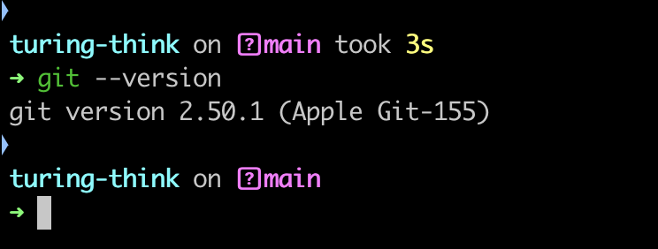

# Git工具安装与使用报告

## 学员GitHub用户名: wangleihd

## 1. Git安装过程

本次安装在`macOS`系统上进行，采用`Homebrew`包管理器安装（推荐方式），具体步骤如下：

1. 检查是否已安装Homebrew：打开终端（应用程序→实用工具→终端），执行`brew --version`。若未安装，执行以下命令安装Homebrew：  

```bash
   /bin/bash -c "$(curl -fsSL https://raw.githubusercontent.com/Homebrew/install/HEAD/install.sh)"
```

   安装过程中需输入电脑开机密码（输入时无显示，输完按回车即可），等待脚本执行完成。
2. 安装Git：在终端中执行以下命令，通过Homebrew安装最新版Git：  

```bash
   brew install git
```

   系统会自动下载并安装Git，同时处理依赖项，无需手动配置环境变量（Homebrew会自动添加路径）。

3. 备选安装方式（若不使用Homebrew）：  
   - 官网下载安装包：访问https://git-scm.com/download/mac，下载对应版本的.pkg安装包，双击后按向导提示完成安装（默认自动配置环境变量）。  
   - Xcode Command Line Tools：终端执行`xcode-select --install`，在弹出的窗口中点击“安装”，包含Git等开发工具（适合已安装Xcode的用户）。

## 2. 遇到的问题及解决方法

1. 问题：执行`brew install git`时提示“Permission denied”（权限不足）。  
   原因：Homebrew安装目录权限设置问题。  
   解决方法：在命令前添加`sudo`获取管理员权限，即`sudo brew install git`，输入开机密码后重试。

2. 问题：安装后终端执行`git --version`提示“command not found”。  
   原因：Git安装路径未添加到系统环境变量（多见于手动安装包未正确配置的情况）。  
   解决方法：  
   - 查找Git安装路径：执行`which git`（正常应显示`/usr/local/bin/git`或`/opt/homebrew/bin/git`）。  
   - 若未找到，手动添加路径：终端执行`echo 'export PATH="/usr/local/bin:$PATH"' >> ~/.zshrc`（macOS默认shell为zsh），然后执行`source ~/.zshrc`使配置生效。

3. 问题：提交中文信息时终端显示乱码或提交后GitHub显示问号。  
   原因：默认编码未配置为UTF-8。  
   解决方法：终端执行以下命令全局配置编码:

```bash
   git config --global core.quotepath false  # 解决文件名中文显示问题
   git config --global i18n.commitencoding utf-8  # 提交信息编码
   git config --global i18n.logoutputencoding utf-8  # 日志输出编码
   export LESSCHARSET=utf-8  # 临时生效，若需永久生效，添加到~/.zshrc
```  

## 3. 版本信息截图

  

## 4. Git命令使用过程总结

1. `git clone`：克隆远程仓库到本地  
   操作：终端进入目标文件夹（如`cd ~/Documents/Projects`），执行`git clone https://github.com/wangleihd/github101.git`，将个人仓库复制到本地。  
   理解：克隆后会生成与仓库同名的文件夹，包含完整的版本历史，是本地开发的基础。macOS终端中路径切换使用`cd`命令，查看当前路径用`pwd`，列表文件用`ls`。

2. `git add`：添加文件到暂存区  
   操作：创建作业文件后（如`touch assignments/lesson2/wangleihd.md`），执行`git add assignments/lesson2/wangleihd.md`（单个文件）或`git add .`（所有修改），将文件纳入提交准备。  
   理解：暂存区是“待提交区”，可通过`git status`查看哪些文件已添加，避免误提交无关内容（如日志文件、临时文件）。

3. `git commit`：提交到本地仓库  
   操作：执行`git commit -m "完成lesson2作业：macOS Git安装与使用记录"`，将暂存区内容写入本地版本库。  
   理解：每次提交需附带简洁清晰的说明（`-m`参数），方便后续通过`git log`追溯修改历史。macOS终端支持中文输入，直接输入中文说明即可。

4. `git push`：推送至远程仓库  
   操作：执行`git push origin main`，将本地提交同步到GitHub个人仓库的`main`分支。  
   理解：首次推送可能需要登录GitHub，推荐使用个人访问令牌（Settings→Developer settings→Personal access tokens）认证，输入用户名和令牌即可。推送成功后，远程仓库与本地保持一致。

5. `git pull`：拉取远程最新更改  
   操作：若远程仓库有更新（如他人提交），执行`git pull origin main`将最新内容拉到本地，避免冲突。  
   理解：多人协作时，提交前先拉取是关键习惯，可提前发现并解决代码冲突（冲突时终端会提示“Automatic merge failed”，需手动编辑冲突文件后重新提交）。

6. 其他常用命令：  
   - `git status`：查看工作区状态（必用命令），清晰显示“已修改未暂存”“已暂存未提交”等状态。  
   - `git log`：查看提交历史，`git log --graph --oneline`可图形化展示分支与提交记录，更直观。  
   - `git checkout -b 新分支名`：创建并切换到新分支，适合功能开发时隔离代码。  

使用体验：macOS终端对Git命令的支持更流畅，Homebrew安装方式简化了环境配置；相比图形化工具，命令行操作能更精准地控制版本流程，尤其是分支管理和冲突解决时，命令行的逻辑性更清晰。初期需记忆常用命令，熟练后效率显著提升。
